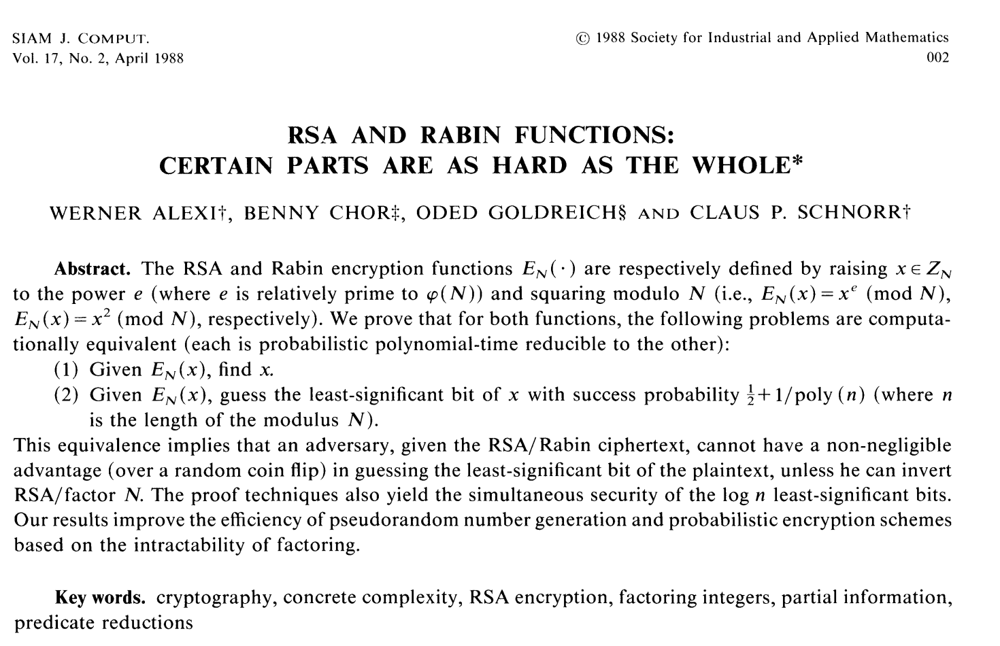

# RSA and Rabin Functions: Certain Parts are as Hard as the Whole (Alexi et al., 1988) LeetArxiv Implementation




This coding guide is best followed alongside this [LeetArxiv article link](https://leetarxiv.substack.com/p/acgs-algorithm-for-hidden-number).

The paper, *RSA and Rabin Functions: Certain Parts are as Hard as the Whole* , introduces the **Alexi-Chor-Goldreich-Schnorr**(ACGS) algorithm for polynomial-time solutions to Hidden Number Problems with Chosen Multipliers (HNP-CM).

This is part of our series on Practical Hidden Number Problems for Programmers:

[Part 1: Quantum Computing and Intro to Hidden Number Problems
](https://leetarxiv.substack.com/p/linear-hidden-number-problem-zero-to-hero-for-computer-scientiests)

[Part 2: Increasing Lattice Volume for Improved HNP Attacks](https://leetarxiv.substack.com/p/guessing-bits-improved-lattice-attacks)

[Part 3: Hidden Number Problems with Multiple Noise Holes
](https://leetarxiv.substack.com/p/pythonsage-extended-hidden-number)

Part 4(We are here): [Hidden Number Problems with Chosen Multipliers](https://leetarxiv.substack.com/p/acgs-algorithm-for-hidden-number)

The paper is considered canonical and is included in MIT’s Foundations of Cryptography series. It introduces ACGS, an alternative to lattice construction techniques for solving HNPs.

ACGS splits into two parts:
1. Guessing the LSB at certain points.
2. Using interval reduction and the guessed LSB's to recover the secret key.

We go over the entire codebase in this [LeetArxiv article](https://leetarxiv.substack.com/p/acgs-algorithm-for-hidden-number).

## Getting Started
You can code alongside the [Google Colab Notebook](https://colab.research.google.com/drive/1rBY2SexlFyGqj8EV9c4sBzfSMBNK7iGG#scrollTo=fnw2_s8vVS8F) or clone the repo and run the jupyter notebook using:
```
git clone https://github.com/MurageKibicho/ACGS-Algorithm-for-Hidden-Number-Problems-with-Chosen-Multipliers.git
```
